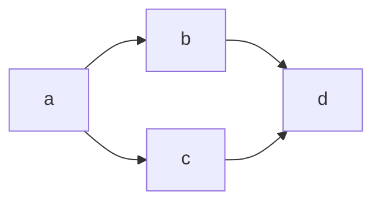
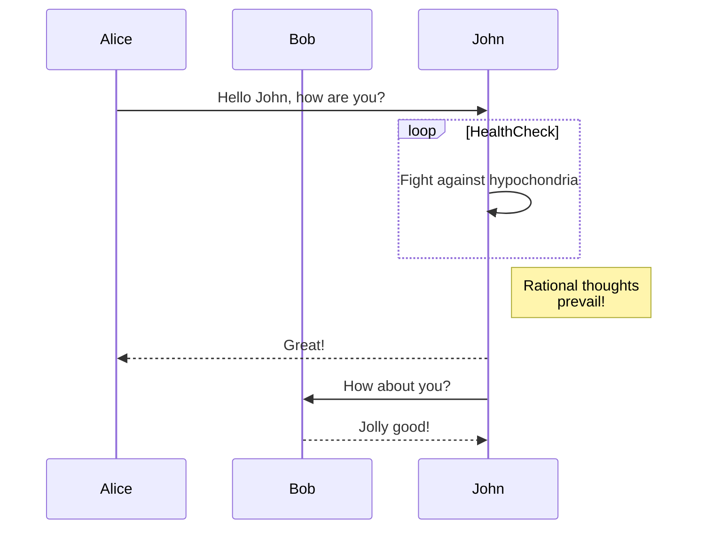
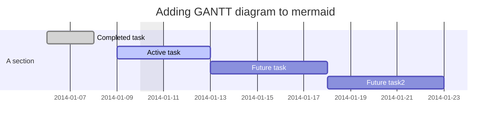
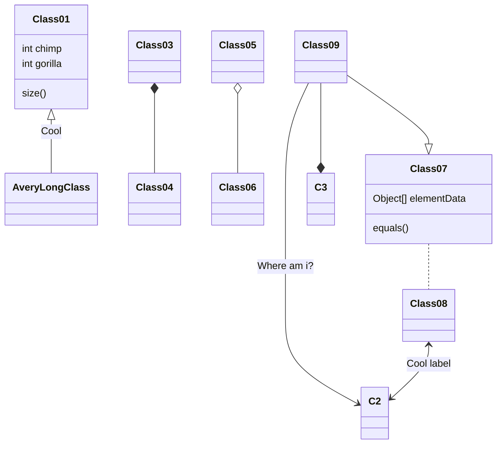

# 概要
「zennでシーケンス図を使って、今後説明できるようにしたいな」と思い、調べてみました。
他で参考したい方がいればぜひお使いください

## zennのmarkdown記法
公式のサイトを見ると、ダイアグラムの形式で使えることが分かりました。その方が意外と簡単である
https://zenn.dev/zenn/articles/markdown-guide#%E3%83%80%E3%82%A4%E3%82%A2%E3%82%B0%E3%83%A9%E3%83%A0

## ダイアグラムサンプル
mermaidを先行して記載するといろんなものが記載できます
下記のURLを確認できると良いかもです！
https://mermaid.js.org/intro/

### フローチャート
#### 縦
graph TD;
    A-->B;
    A-->C;
    B-->D;
    C-->D;

#### 横
graph LR
   a --> b & c--> d

### シーケンス図

sequenceDiagram
    participant Alice
    participant Bob
    Alice->>John: Hello John, how are you?
    loop HealthCheck
        John->>John: Fight against hypochondria
    end
    Note right of John: Rational thoughts  prevail!
    John-->>Alice: Great!
    John->>Bob: How about you?
    Bob-->>John: Jolly good!

### ガントチャート

gantt
dateFormat  YYYY-MM-DD
title Adding GANTT diagram to mermaid
excludes weekdays 2014-01-10

section A section
Completed task            :done,    des1, 2014-01-06,2014-01-08
Active task               :active,  des2, 2014-01-09, 3d
Future task               :         des3, after des2, 5d
Future task2               :         des4, after des3, 5d

### クラス図

classDiagram
Class01 <|-- AveryLongClass : Cool
Class03 *-- Class04
Class05 o-- Class06
Class07 .. Class08
Class09 --> C2 : Where am i?
Class09 --* C3
Class09 --|> Class07
Class07 : equals()
Class07 : Object[] elementData
Class01 : size()
Class01 : int chimp
Class01 : int gorilla
Class08 <--> C2: Cool label

